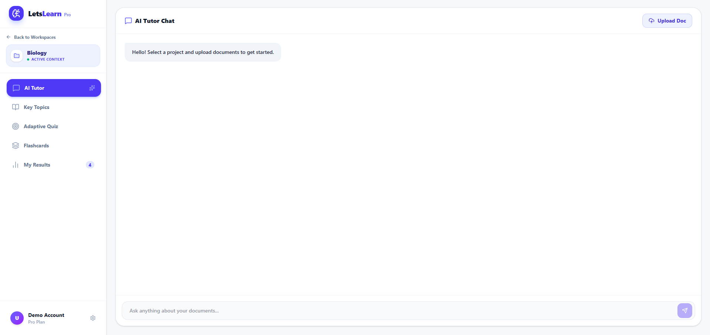
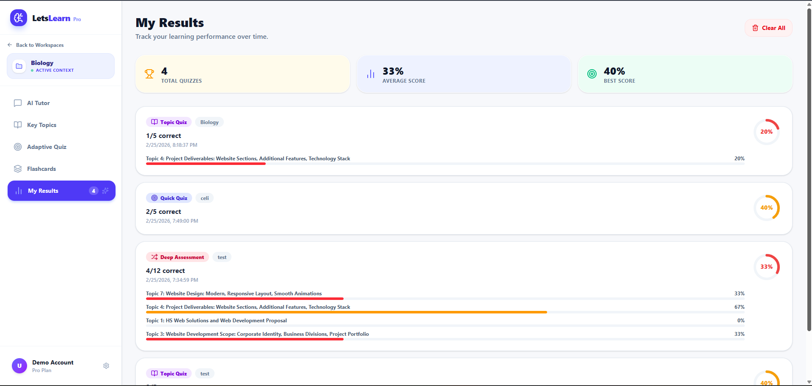
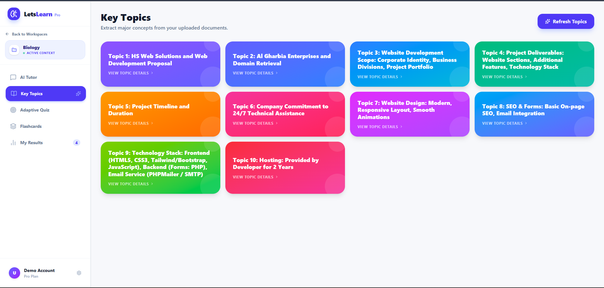

# 🎓 LetsLearn - AI-Powered Learning Platform

LetsLearn is an intelligent, locally-hosted educational application that uses **Retrieval-Augmented Generation (RAG)** to help you interact with and learn from your documents. Upload your study materials and let AI power transform them into interactive learning tools—all running **100% offline** on your machine.

## 🌟 Key Features

### 📚 **Smart Document Management**

- **Multi-Project Organization**: Create and manage unlimited projects to organize your study materials by subject, course, or topic
- **Flexible File Upload**: Support for multiple document formats (PDF, text, and more)
- **Intelligent Chunking**: Documents are automatically split into optimal chunks for semantic understanding
- **Instant Indexing**: Files are immediately embedded into the vector database upon upload for instant access

### 💬 **AI-Powered Chat with RAG**

- **Context-Aware Answers**: Ask questions about your documents and get precise answers grounded strictly in your uploaded materials
- **Semantic Search**: Advanced vector-based retrieval finds the most relevant content from your documents
- **Streaming Responses**: Real-time response generation for immediate feedback
- **Offline Privacy**: All processing happens locally—your data never leaves your machine

### 📝 **Flashcard Generation**

- **Automatic Flashcard Creation**: AI automatically generates study flashcards from your document content
- **Customizable Learning Sets**: Create topic-specific flashcard decks
- **Spaced Repetition Ready**: Organize flashcards by topic for optimal study patterns
- **Study Mode Integration**: Built-in flashcard viewer for interactive studying

### 🎯 **Smart Quiz Generation**

- **Auto-Generated Quizzes**: Create multiple-choice quizzes directly from your documents
- **Intelligent Questions**: AI generates diverse, challenging questions based on key concepts
- **Instant Assessment**: Take quizzes immediately after uploading materials
- **Performance Analytics**: Track your scores and identify weak areas

### 🗂️ **Topic & Notes Extraction**

- **Key Topic Identification**: Automatically extract and organize the main topics covered in your documents
- **Smart Summarization**: AI generates concise summaries of important concepts
- **Topic-Based Organization**: Group content by topics for better understanding
- **Study Roadmap**: See all covered topics at a glance

### 📊 **Analytics Dashboard**

- **Learning Progress Tracking**: Monitor your quiz scores and learning metrics
- **Performance Insights**: Visualize your progress across different subjects
- **Study Statistics**: Track flashcard reviews, quiz attempts, and study time
- **Real-Time Metrics**: Updated analytics as you study

---

## 🏗️ Architecture

### **Frontend**

- **Framework**: React + Vite
- **Styling**: Tailwind CSS with modern UI components
- **Routing**: React Router for multi-page navigation
- **Features**: Dashboard, analytics, flashcards, quizzes, and topic views

### **Backend**

- **Framework**: FastAPI (Python)
- **API**: RESTful with streaming response support
- **File Processing**: Smart document parser with format support
- **Project Management**: Multi-project architecture with caching

### **AI/ML Components**

- **Large Language Model (LLM)**: Mistral (`models/mistral.gguf`)
  - Runs entirely locally via `llama-cpp-python`
  - Optimized for 8K token context window
  - GPU acceleration (CUDA) for faster inference
- **Embedding Engine**: `BAAI/bge-small-en-v1.5` via SentenceTransformers
  - Converts text chunks into semantic vectors
  - Used for intelligent document retrieval
- **Vector Database**: ChromaDB
  - Stores and retrieves document embeddings
  - Fast semantic similarity search
  - Persistent storage across sessions

---

## 📸 Screenshots

### Dashboard


_Main interface for project creation, file upload, and document management_

### Analytics & Performance Tracking


_Real-time analytics dashboard showing quiz scores, learning progress, and study metrics_

### Topics & Study Organization


_Automatically extracted topics and key concepts from your documents_

---

## 🚀 Getting Started

### Prerequisites

- Python 3.10+
- Node.js & npm
- 4GB+ RAM (8GB+ recommended for GPU support)
- Storage: ~8GB for the Mistral model

### Installation

1. **Clone the repository**

   ```bash
   git clone <repository-url>
   cd letslearn
   ```

2. **Set up Python environment**

   ```bash
   python -m venv .venv
   .\.venv\Scripts\activate  # Windows
   # or
   source .venv/bin/activate  # Linux/Mac
   ```

3. **Install Python dependencies**

   ```bash
   pip install -r requirements.txt
   ```

4. **Download the AI model**

   ```bash
   python download_model.py
   ```

5. **Set up frontend**

   ```bash
   cd frontend
   npm install
   ```

6. **Start the application**

   ```bash
   # Terminal 1: Start backend server
   python server.py

   # Terminal 2: Start frontend dev server
   cd frontend
   npm run dev
   ```

---

## 💡 How It Works

1. **Upload Documents**: Create a project and upload your study materials (PDFs, text files, etc.)
2. **Automatic Processing**: Documents are parsed, chunked, and embedded into ChromaDB using `BAAI/bge-small-en-v1.5`
3. **Query Processing**: When you ask a question, the system:
   - Converts your question into a semantic vector
   - Searches ChromaDB for relevant document chunks
   - Feeds the retrieved context to Mistral LLM
   - Generates a grounded, context-aware answer
4. **Content Generation**: Automatically create:
   - Study flashcards from key concepts
   - Multiple-choice quizzes for self-assessment
   - Topic summaries and learning roadmaps

---

## 🔒 Privacy & Security

- **100% Offline**: All AI processing runs locally on your machine
- **No Cloud Dependencies**: No data is sent to external servers
- **Open Source**: Full transparency of how your data is handled
- **Local Storage**: All documents and embeddings stored in your project folders

---

## 📝 Technical Stack

| Component            | Technology                                    |
| -------------------- | --------------------------------------------- |
| **Backend**          | FastAPI (Python 3.10+)                        |
| **Frontend**         | React 18 + Vite + Tailwind CSS                |
| **LLM**              | Mistral (7B parameters) via llama-cpp-python  |
| **Embeddings**       | BAAI/bge-small-en-v1.5 (SentenceTransformers) |
| **Vector DB**        | ChromaDB                                      |
| **Document Parsing** | Custom parser with multi-format support       |

---

## 🎓 Use Cases

- 📖 **Study Material Organization**: Upload textbooks, lecture notes, and organize by topic
- 🧪 **Self-Assessment**: Generate quizzes to test your knowledge
- 📚 **Flashcard Studying**: Create custom flashcards for spaced repetition learning
- 🔍 **Quick Reference**: Ask questions about your materials and get instant answers
- 📊 **Progress Tracking**: Monitor your learning with built-in analytics
- 👨‍🎓 **Learning Companions**: Perfect for students, professionals, and lifelong learners

---

## 👨‍💻 Credits

Strictly built by **Himadri Shekhar Goswami** for CODE300.

---

## 📄 License

This project is provided as-is for educational purposes.
